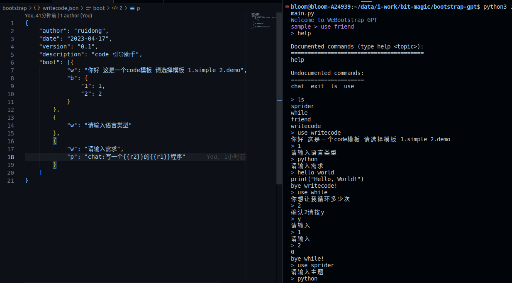

# bootstrap-gpt

> 引导 gpt 帮你高效完成各种事情, 写 gpt prompts 程序，gpt prompts 自动化




## 下载

## 设置 api key

.env

```
api_key=sk-xxxxxxxxxxxxxxxxxxxxxxxxxxxxxxxxxxxxxxxxxxxxx
```

## 运行

```
cd bootstrap-gpt

pip install openai && pip install beautifulsoup4 && pip install jsonpath && pip install jinja2

python3 ./main.py
```

## 引导示例

```
{
    "author": "ruidong",
    "date": "2023-04-17",
    "version": "0.1",
    "description": "code 引导助手",
    "boot": [{
            "w": "你好 这是一个code模板 请选择模板 1.simple 2.demo",
            "b": {
                "1": 1,
                "2": 2
            }
        },
        {
            "w": "请输入语言类型"
        },
        {
            "w": "请输入需求",
            "p": "chat:写一个{{r2}}的{{r1}}程序"
        }
    ]
}
```

- w: write 支持模板变量
- b: branch 分支 支持 Object 字段 eq 跳转 和 Array 循序执行 或 无继续往下执行
- p: prompt 支持模板变量 微指令 用于引导 chatgpt[chat:] 给其文案 或 爬虫[sprider:]搜索 纯文本[text:]输出， 可以扩展更多微指令提示引导

r2 r1 为变量名称 为类型+index 索引 有 r：reader w:writer p:prompts m:msg 之分

生成规则参考[interpreter.py](./interpreter.py)
