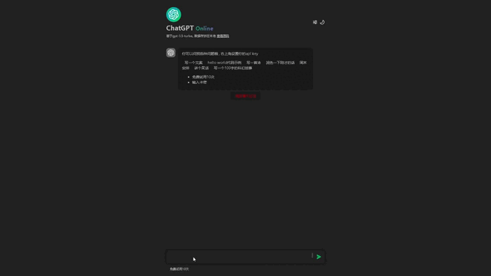

# bootstrap-gpt

> 引导 gpt 帮你高效完成各种事情，可以联网，支持 prompts 编排，没有完全 auto 更多自定义空间，自己编排任务流




## 下载

## 设置 api key

.env

```
api_key=sk-xxxxxxxxxxxxxxxxxxxxxxxxxxxxxxxxxxxxxxxxxxxxx
```

## 运行

```
cd bootstrap-gpt

pip install openai && pip install beautifulsoup4 && pip install jsonpath && pip install jinja2

python3 ./main.py
```

## http server

```
> python3 ./main.py

Welcome to Bootstrap GPT
sample > use summarize

> serve
HTTP Server running on port 8080
```

**api**

```
post /v1/chat/completions
{"messages":[{"role":"user","content":"v2-hot"}],"model":"gpt-3.5-turbo"}
```

res

```
{"choices": [{"message": {"role": "assistant", "content": "hello"}]}
```

配合 [chat-gpt-online](https://weekendproject.space/chat-gpt-online.html) 食用效果更佳

## 引导示例

- summarize.json

```
{
    "author": "ruidong",
    "date": "2023-04-19",
    "version": "0.1",
    "description": "总结网页",
    "boot": [{
        "w": "请输入网址",
        "r": "r0",
        "p": "spider:{{r0}}:select=article"
    }, {
        "p": "chat:总结一下这个页面介绍了什么{{m0}}"
    }, {
        "w": "总结: {{m1}} \n还要总结其他网页吗? y/n",
        "r": "r2",
        "b": {
            "y": 0,
            "n": -1
        }
    }]
}
```

- w: write 支持模板变量
- r: read 读取输入
- b: branch 分支 支持 Object 字段 eq 跳转 和 Array 循序执行 或 无继续往下执行
- p: prompt 支持模板变量 微指令 用于引导 chatgpt[chat:] 给其文案 或 爬虫[sprider:]搜索 纯文本[text:]输出， 可以扩展更多微指令提示引导

r2 r1 为变量名称 为类型+index 索引 有 r：reader w:writer p:prompts m:msg 之分

生成规则参考[interpreter.py](./interpreter.py)
