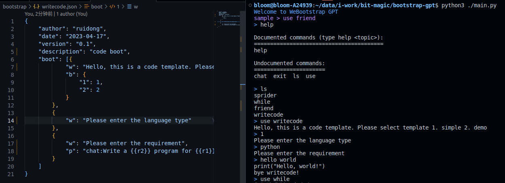

# bootstrap-gpt

> Guide GPT to help you efficiently complete various tasks, write GPT prompts programs, and automate GPT prompts, support web api




[cn](./README-CN.md)

## download

## set api key

.env

```
api_key=sk-xxxxxxxxxxxxxxxxxxxxxxxxxxxxxxxxxxxxxxxxxxxxx
```

## run

```
cd bootstrap-gpt

pip install openai && pip install beautifulsoup4 && pip install jsonpath && pip install jinja2

python3 ./main.py
```

## api

```
post /v1/chat/completions
{"messages":[{"role":"user","content":"v2-hot"}],"model":"gpt-3.5-turbo"}
```

res

```
{"choices": [{"message": {"role": "assistant", "content": "hello"}]}
```

coordination https://github.com/weekend-project-space/chatgpt-online Better eating effect

## bootstrap simple

```
{
    "author": "ruidong",
    "date": "2023-04-17",
    "version": "0.1",
    "description": "code boot",
    "boot": [{
            "w": "Hello, this is a code template. Please select template 1. simple 2. demo",
            "b": {
                "1": 1,
                "2": 2
            }
        },
        {
            "w": "Please enter the language type"
        },
        {
            "w": "Please enter the requirement",
            "p": "chat:Write a {{r2}} program for {{r1}}"
        }
    ]
}
```

-W: write supports template variables

-B: Branch branch supports object field eq jump and Array sequential execution or no further execution

-P: prompt supports template variable micro instructions for guiding chatgt [chat:] to search for plain text or crawler [spider:] output, which can expand more micro instruction prompt guidance

r2 r1 is a variable with a name of type and an index of r: reader w: writer p: prompts m: msg

Generate Rule Reference [interpreter.py](./interpreter.py)
